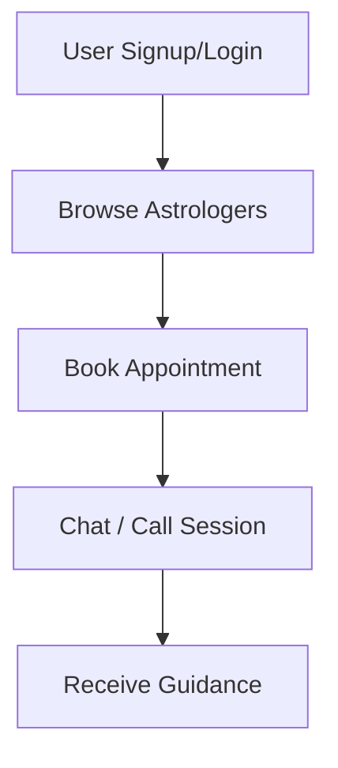
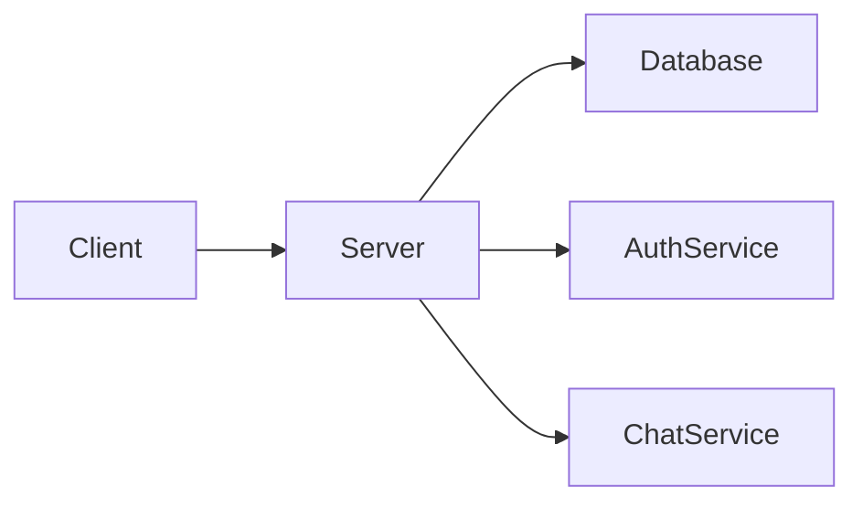
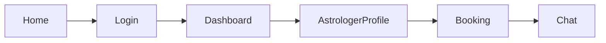

# 🔮 AstreaConnect — Astrology Platform

A modern astrology platform where **users** and **astrologers** connect for **personalized readings, consultations, and guidance**.

---

## 🌌 Overview

AstroConnect bridges the gap between seekers and experts by providing:

* 🧑‍🤝‍🧑 Direct interaction between users & astrologers
* 📅 Appointment scheduling
* 💬 Real-time chat & consultation
* 📊 Horoscope & prediction insights

---

## 🧭 Platform Flow



---

## 🏗️ System Architecture



---

## 📦 Tech Stack

| Layer    | Technology             |
| -------- | ---------------------- |
| Frontend | Flutter / Web (React)  |
| Backend  | Node.js + Express      |
| Database | PostgreSQL / MySQL     |
| Realtime | WebSockets / Socket.IO |
| Auth     | JWT Authentication     |

---

## ✨ Features

### 👤 User Features

* Register & login
* View astrologer profiles
* Book consultations
* Chat with astrologers
* Get personalized predictions

### 🔮 Astrologer Features

* Create profile
* Set availability
* Accept/reject bookings
* Chat with users
* Manage sessions

---

## 📊 Database Design (Simplified)

| Table       | Description                          |
| ----------- | ------------------------------------ |
| users       | Stores user data                     |
| astrologers | Astrologer profiles                  |
| bookings    | Appointment details                  |
| chats       | Messages between users & astrologers |

---

## 🗂️ Project Structure

```bash
src/
├── config/
├── models/
├── controllers/
├── routes/
├── services/
└── app.js
```

---

## 🔐 Environment Variables

```env
PORT=3000
DB_HOST=localhost
DB_USER=root
DB_PASS=password
JWT_SECRET=your_secret_key
```

---

## 🚀 Getting Started

```bash
# Install dependencies
npm install

# Run server
npm run dev
```

---

## 📸 UI Concept (Sample Flow)



---

## 🧠 Future Enhancements

* 🧾 Payment Integration
* 🤖 AI-based horoscope predictions
* 📱 Mobile app (Flutter)
* 🌍 Multi-language support

---

## 🤝 Contribution

Pull requests are welcome. For major changes, please open an issue first.

---

## 📜 License

MIT License

---

## 🌟 Vision

To create a **trusted digital space** where spiritual guidance meets modern technology.
